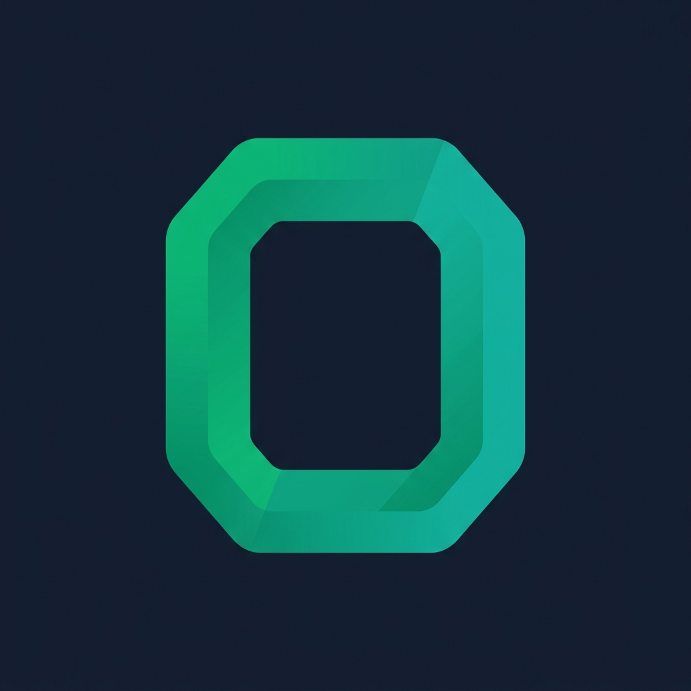

<p align="center">
  
</p>

<h1 align="center">Omesh Kumar — Portfolio</h1>

<p align="center">
  <strong>Fullstack Developer & AI Integration Specialist</strong><br/>
  A modern, animated personal portfolio built with Next.js 16, React 19, and Framer Motion.
</p>

<p align="center">
  <a href="https://omeshkumar.vercel.app">🌐 Live Site</a> ·
  <a href="https://www.linkedin.com/in/iamomeshkumarr/">💼 LinkedIn</a> ·
  <a href="https://github.com/omeshkumarfso">🐙 GitHub</a>
</p>

---

## ✨ Features

- **Animated Hero Section** — Profile photo with pulsing gradient border, floating sparkle particles, and staggered text entrance animations
- **About Me** — Stats cards, highlight grid with hover effects, and a professional journey summary
- **Skills & Technologies** — Animated progress bars across 4 categories (Frontend, Backend, Tools, Libraries)
- **Professional Experience** — Interactive vertical timeline with alternating layout, company cards, and achievement lists
- **Featured Projects** — Alternating image/detail layouts with metrics, tech badges, feature checklists, and live demo links
- **Contact Form** — Two-column layout with animated contact cards, social links, and a styled form
- **SEO Optimized** — Open Graph, Twitter Cards, JSON-LD structured data, sitemap, and robots.txt
- **Fully Responsive** — Mobile-first design with breakpoints for all screen sizes
- **Dark Theme** — Sleek slate/emerald color palette with gradient accents throughout

---

## 🛠 Tech Stack

| Category        | Technology                                                          |
| --------------- | ------------------------------------------------------------------- |
| **Framework**   | [Next.js 16](https://nextjs.org/) (App Router)                     |
| **Language**    | [TypeScript](https://www.typescriptlang.org/)                      |
| **UI Library**  | [React 19](https://react.dev/)                                     |
| **Styling**     | [Tailwind CSS 3](https://tailwindcss.com/) + tailwindcss-animate   |
| **Animations**  | [Framer Motion 12](https://www.framer.com/motion/)                 |
| **Icons**       | [Lucide React](https://lucide.dev/)                                |
| **Font**        | [Inter](https://fonts.google.com/specimen/Inter) (Google Fonts)    |
| **Utilities**   | clsx, tailwind-merge                                               |
| **Package Mgr** | [Bun](https://bun.sh/)                                            |

---

## 📁 Project Structure

```
omeshkumarPortfolio/
├── app/
│   ├── globals.css          # Global styles & Tailwind imports
│   ├── layout.tsx           # Root layout with metadata, SEO, JSON-LD
│   ├── page.tsx             # Home page composing all sections
│   ├── robots.ts            # Robots.txt generation
│   ├── sitemap.ts           # Sitemap generation
│   ├── icon.png             # Favicon
│   └── apple-icon.png       # Apple touch icon
├── components/
│   ├── Hero.tsx             # Hero section with sparkle animations
│   ├── About.tsx            # About me with stats & highlights
│   ├── Skills.tsx           # Skills with animated progress bars
│   ├── Experience.tsx       # Timeline-based work experience
│   ├── Projects.tsx         # Featured projects showcase
│   ├── Contact.tsx          # Contact form & info cards
│   └── theme-provider.tsx   # Theme context provider
├── hooks/
│   ├── use-mobile.tsx       # Mobile breakpoint detection hook
│   └── use-toast.ts         # Toast notification hook
├── lib/
│   └── utils.ts             # Utility functions (cn helper)
├── styles/
│   └── globals.css          # Additional global styles
├── public/                  # Static assets (project screenshots, icons, resume)
├── tailwind.config.ts       # Tailwind CSS configuration
├── next.config.mjs          # Next.js configuration
├── tsconfig.json            # TypeScript configuration
└── package.json             # Dependencies & scripts
```

---

## 🚀 Getting Started

### Prerequisites

- **Node.js** 18+ or **Bun** 1.0+
- **Git**

### Installation

```bash
# Clone the repository
git clone https://github.com/omeshkumarfso/omeshkumarPortfolio.git
cd omeshkumarPortfolio

# Install dependencies (using Bun)
bun install

# Or with npm
npm install
```

### Development

```bash
# Start the dev server
bun run dev
# or
npm run dev
```

Open [http://localhost:3000](http://localhost:3000) in your browser.

### Production Build

```bash
# Build for production
bun run build
# or
npm run build

# Start production server
bun run start
# or
npm run start
```

---

## 📜 Available Scripts

| Script          | Description                        |
| --------------- | ---------------------------------- |
| `dev`           | Start Next.js development server   |
| `build`         | Create optimized production build  |
| `start`         | Start production server            |
| `lint`          | Run ESLint checks                  |

---

## 🎨 Design System

The portfolio uses a cohesive design language:

- **Primary Palette** — Emerald → Teal gradient (`#10b981` → `#14b8a6`)
- **Accent** — Orange → Amber (`#f97316` → `#f59e0b`)
- **Background** — Slate tones (`slate-900` through `slate-700`)
- **Glass Effects** — `backdrop-blur-sm` with semi-transparent backgrounds
- **Typography** — Inter font family with bold gradient text headings
- **Animations** — Scroll-triggered entrance animations, hover scale/rotate effects, infinite sparkle particles

---

## 🌐 SEO & Performance

- **Metadata** — Comprehensive Open Graph and Twitter Card tags
- **JSON-LD** — Structured data for Person schema
- **Sitemap** — Auto-generated at `/sitemap.xml`
- **Robots** — Configured for full crawl access
- **Fonts** — Optimized via `next/font/google` (zero layout shift)
- **Images** — Optimized with lazy loading and responsive sizing

---

## 📬 Contact

- **Email** — [omeshkumarfso@gmail.com](mailto:omeshkumarfso@gmail.com)
- **Phone** — [+91 9634409101](tel:+919634409101)
- **LinkedIn** — [iamomeshkumarr](https://www.linkedin.com/in/iamomeshkumarr/)
- **GitHub** — [omeshkumarfso](https://github.com/omeshkumarfso)
- **Website** — [https://omeshkumar.vercel.app](https://omeshkumar.vercel.app/)

---

## 📄 License

This project is private and not licensed for redistribution.

---

<p align="center">
  Built with ❤️ by <a href="https://omeshkumar.vercel.app/">Omesh Kumar</a>
</p>
